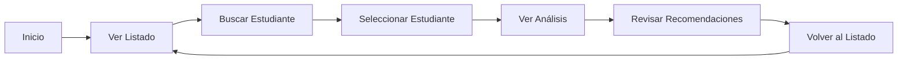

# 🎓 Sistema Predictivo de Deserción Estudiantil


Sistema web de análisis predictivo para identificar estudiantes en riesgo de deserción académica, utilizando Inteligencia Artificial para generar recomendaciones personalizadas.

---

## 📋 Tabla de Contenidos

- [Descripción](#-descripción)
- [Características Principales](#-características-principales)
- [Tecnologías Utilizadas](#-tecnologías-utilizadas)
- [Requisitos Previos](#-requisitos-previos)
- [Instalación](#-instalación)
- [Uso](#-uso)
- [Estructura del Proyecto](#-estructura-del-proyecto)
- [Componentes Principales](#-componentes-principales)
- [API y Hooks](#-api-y-hooks)
- [Estilos y Diseño](#-estilos-y-diseño)
- [Funcionalidades Detalladas](#-funcionalidades-detalladas)
- [Capturas de Pantalla](#-capturas-de-pantalla)
- [Contribución](#-contribución)
- [Licencia](#-licencia)

---

## 🎯 Descripción

El **Sistema Predictivo de Deserción Estudiantil** es una aplicación web moderna diseñada para instituciones educativas que buscan identificar tempranamente a estudiantes en riesgo de abandonar sus estudios. 

### Objetivo Principal
Proporcionar una herramienta intuitiva y eficiente que permita:
- Analizar factores de riesgo académico
- Predecir probabilidades de deserción
- Generar recomendaciones personalizadas mediante IA
- Facilitar la toma de decisiones para intervenciones tempranas

---

## ✨ Características Principales

### 🔍 **Búsqueda y Filtrado Inteligente**
- **Búsqueda por código de estudiante** en tiempo real
- Filtrado instantáneo con contador de resultados
- Mensaje informativo cuando no hay coincidencias
- Reseteo automático de paginación al filtrar

### 📊 **Visualización de Estudiantes**
- **Listado paginado** (4 estudiantes por página)
- **Tarjetas visuales** con información clave:
  - Nombre del estudiante
  - Código identificador (con icono)
  - Nivel de riesgo (porcentaje)
  - Estado de riesgo (color codificado)
  - Promedio académico
  - Nivel de motivación
  - Asistencia semanal
  - Factor socioeconómico
- **Indicadores de riesgo por color**:
  - 🔴 **Rojo**: Riesgo Alto (>60%)
  - 🟠 **Naranja**: Riesgo Medio (30-60%)
  - 🟢 **Verde**: Riesgo Bajo (<30%)

### � **Análisis Predictivo con IA**
- Evaluación automática de riesgo de deserción
- Análisis de múltiples factores académicos y personales
- **Factores analizados**:
  - Promedio académico (0-5)
  - Nivel de motivación (1-10)
  - Asistencia semanal (0-40 horas)
  - Factor socioeconómico (1-5)

### � **Recomendaciones Personalizadas**
- Generación automática de recomendaciones mediante IA
- Identificación de problemas específicos
- Sugerencias de intervención adaptadas a cada caso
- Formato legible y estructurado

### 📱 **Diseño Responsivo**
- Interfaz adaptable a dispositivos móviles, tablets y desktop
- Grid responsivo que se ajusta automáticamente
- Navegación optimizada para touch y mouse
- Experiencia de usuario consistente en todos los dispositivos

### 🎨 **Interfaz Moderna**
- Diseño limpio y profesional
- Iconos SVG de **Lucide React**
- Animaciones suaves y transiciones fluidas
- Paleta de colores institucional
- Efectos hover y estados visuales claros

---

## �️ Tecnologías Utilizadas

### Frontend Framework
- **[Astro](https://astro.build/)** `v5.16.0` - Framework web moderno para sitios rápidos
- **[React](https://react.dev/)** `v19.2.0` - Biblioteca para interfaces de usuario
- **[@astrojs/react](https://docs.astro.build/en/guides/integrations-guide/react/)** `v4.4.2` - Integración de React en Astro

### UI/UX
- **[Lucide React](https://lucide.dev/)** `v0.554.0` - Iconos SVG modernos y personalizables
- **CSS Variables** - Sistema de diseño consistente
- **CSS Nesting** - Estilos organizados y mantenibles
- **Responsive Design** - Mobile-first approach

### Lenguajes
- **JavaScript/JSX** - Lógica de componentes
- **CSS3** - Estilos y animaciones
- **HTML5** - Estructura semántica

### Herramientas de Desarrollo
- **npm** - Gestor de paquetes
- **Git** - Control de versiones
- **VS Code** - Editor recomendado

---

## 📦 Requisitos Previos

Antes de comenzar, asegúrate de tener instalado:

- **Node.js** >= 18.0.0
- **npm** >= 9.0.0 (o **yarn** / **pnpm** / **bun**)
- **Git** (opcional, para clonar el repositorio)

Verifica las versiones instaladas:
```bash
node --version
npm --version
```

---

## 🚀 Instalación

### 1. Clonar el Repositorio
```bash
git clone https://github.com/tu-usuario/projecto-ai-frontend.git
cd projecto-ai-frontend
```

### 2. Instalar Dependencias
```bash
npm install
```

### 3. Iniciar el Servidor de Desarrollo
```bash
npm run dev
```

El servidor se iniciará en `http://localhost:4321`

### 4. Compilar para Producción
```bash
npm run build
```

### 5. Previsualizar Build de Producción
```bash
npm run preview
```

---

## 💻 Uso

### Navegación Principal

1. **Página de Inicio**
   - Hero header con información del sistema
   - Características destacadas (IA, Real-Time, Personalizado)
   - Acceso directo al sistema de predicción

2. **Panel de Estudiantes**
   - Visualiza la lista completa de estudiantes
   - Usa el **campo de búsqueda** para filtrar por código
   - Haz clic en cualquier tarjeta para ver el análisis detallado

3. **Vista de Análisis**
   - Revisa los resultados de la predicción
   - Consulta los factores de riesgo identificados
   - Lee las recomendaciones de IA personalizadas
   - Regresa al listado con el botón de navegación

### Flujo de Trabajo Típico



---

## 📁 Estructura del Proyecto

```
projecto-ai-frontend/
├── public/                      # Archivos estáticos
│   └── favicon.svg
├── src/
│   ├── assets/                  # Recursos (imágenes, etc.)
│   ├── components/              # Componentes React
│   │   ├── DropoutPredictor.jsx    # Formulario y resultados
│   │   ├── MainPredictorUI.jsx     # Componente principal
│   │   └── StudentListPanel.jsx    # Panel de estudiantes
│   ├── hooks/                   # Custom React Hooks
│   │   └── usePrediction.js        # Hook para API de predicción
│   ├── layouts/                 # Layouts de Astro
│   │   └── Layout.astro
│   ├── pages/                   # Páginas de la aplicación
│   │   └── index.astro             # Página principal
│   └── styles/                  # Estilos globales
│       └── global.css              # Variables CSS y estilos base
├── .gitignore
├── astro.config.mjs             # Configuración de Astro
├── package.json                 # Dependencias del proyecto
├── README.md                    # Este archivo
└── tsconfig.json                # Configuración de TypeScript
```

---

## 🧩 Componentes Principales

### 1. **MainPredictorUI.jsx**
**Componente orquestador principal**

**Responsabilidades:**
- Gestiona el estado global de la aplicación
- Controla la navegación entre vistas (listado/análisis)
- Maneja la selección de estudiantes
- Coordina las llamadas a la API

**Props:** Ninguna (componente raíz)

**Estados:**
- `viewMode`: 'list' | 'result'
- `selectedStudent`: objeto del estudiante seleccionado

**Características:**
- Barra de navegación con gradiente
- Indicador de vista actual
- Información del estudiante seleccionado
- Badge de "Análisis de Riesgo"

---

### 2. **StudentListPanel.jsx**
**Panel de visualización de estudiantes**

**Props:**
```javascript
{
  students: Array,        // Lista de estudiantes
  onSelectStudent: Function,  // Callback al seleccionar
  loading: Boolean,       // Estado de carga
  error: String          // Mensaje de error
}
```

**Características:**
- **Búsqueda en tiempo real** por código de estudiante
- **Paginación** (4 estudiantes por página)
- **Estadísticas dinámicas**:
  - Total de estudiantes
  - Estudiantes filtrados
  - Página actual
- **Tarjetas interactivas** con:
  - Efecto hover (elevación)
  - Indicador de riesgo (badge)
  - Información completa del estudiante
  - Borde coloreado según nivel de riesgo

**Estados internos:**
- `currentPage`: Página actual de la paginación
- `searchFilter`: Texto de búsqueda

**Funciones:**
- `handleSearchChange()`: Filtra y resetea paginación
- `getRiskColor()`: Determina color según nivel de riesgo
- `getRiskClass()`: Asigna clase CSS según riesgo

---

### 3. **DropoutPredictor.jsx**
**Componente de análisis y predicción**

**Props:**
```javascript
{
  defaultData: Object,    // Datos iniciales del estudiante
  defaultCaseName: String, // Nombre del caso
  onPredict: Function,    // Callback para nueva predicción
  result: Object,         // Resultados del análisis
  loading: Boolean,       // Estado de carga
  error: String          // Mensaje de error
}
```

**Características:**
- **Formulario de entrada** (actualmente oculto):
  - Promedio académico
  - Nivel de motivación
  - Asistencia semanal
  - Factor socioeconómico
- **Visualización de resultados**:
  - Porcentaje de riesgo
  - Estado (Alto/Medio/Bajo)
  - Barra de progreso visual
  - Factores analizados
  - Problemas identificados
  - Recomendaciones de IA
- **Estados de carga y error**
- **Animaciones de transición**

**Estados internos:**
- `formData`: Datos del formulario

**Funciones:**
- `handleInputChange()`: Actualiza campos del formulario
- `handleSubmit()`: Envía datos para análisis
- `getRiskColor()`: Color según nivel de riesgo
- `getRiskClass()`: Clase CSS según riesgo

---

## 🔌 API y Hooks

### usePrediction Hook

**Ubicación:** `src/hooks/usePrediction.js`

**Funcionalidad:**
Custom hook que gestiona todas las interacciones con la API de predicción.

**Retorna:**
```javascript
{
  studentList: Array,           // Lista de estudiantes
  result: Object,               // Resultado de predicción
  loading: Boolean,             // Estado de carga
  error: String,                // Mensaje de error
  fetchStudentList: Function,   // Obtener lista de estudiantes
  predictDropout: Function      // Realizar predicción
}
```

**Endpoints utilizados:**
- `GET /api/students` - Obtener lista de estudiantes
- `POST /api/predict` - Realizar predicción de deserción

**Ejemplo de uso:**
```javascript
const {
  studentList,
  result,
  loading,
  error,
  fetchStudentList,
  predictDropout
} = usePrediction();

// Obtener estudiantes
useEffect(() => {
  fetchStudentList();
}, []);

// Realizar predicción
const handlePredict = (studentData) => {
  predictDropout(studentData);
};
```

---

## 🎨 Estilos y Diseño

### Sistema de Colores

**Variables CSS definidas en `global.css`:**

```css
:root {
  /* Colores Principales */
  --color-primary-dark: #102e50;      /* Azul institucional */
  --color-secondary-light: #f5c45e;   /* Amarillo énfasis */
  
  /* Colores de Riesgo */
  --color-risk-low: #388e3c;          /* Verde - Riesgo bajo */
  --color-risk-medium: #e78b48;       /* Naranja - Riesgo medio */
  --color-risk-high: #be3d2a;         /* Rojo - Riesgo alto */
  
  /* Texto y Fondo */
  --color-text-dark: #102e50;
  --color-text-light: #ffffff;
  --color-background: #f8f8f8;
  --color-card-background: #ffffff;
}
```

### Clases CSS Principales

#### Hero Header
```css
.hero-header          /* Cabecera con gradiente */
.hero-container       /* Contenedor centrado */
.hero-icon            /* Icono animado */
.hero-title           /* Título principal */
.hero-subtitle        /* Subtítulo */
.hero-description     /* Descripción */
```

#### Features
```css
.features-grid        /* Grid de características */
.feature-card         /* Tarjeta de característica */
.feature-icon         /* Icono de característica */
.feature-title        /* Título de característica */
.feature-description  /* Descripción */
```

#### Predictor UI
```css
.predictor-wrapper         /* Contenedor principal */
.predictor-navbar          /* Barra de navegación */
.predictor-navbar-content  /* Contenido de navbar */
.predictor-nav-button      /* Botón de navegación */
  .active                  /* Estado activo */
  .inactive                /* Estado inactivo */
.predictor-student-info    /* Info del estudiante */
.predictor-badge           /* Badge de análisis */
.predictor-content         /* Contenedor de contenido */
.predictor-view            /* Vista con animación */
```

#### Estados de Riesgo
```css
.risk-status          /* Badge de estado */
.risk-high            /* Riesgo alto (rojo) */
.risk-medium          /* Riesgo medio (naranja) */
.risk-low             /* Riesgo bajo (verde) */
```

### Animaciones

```css
@keyframes float {
  /* Animación flotante para iconos */
}

@keyframes fadeIn {
  /* Animación de entrada para vistas */
}
```

### Responsive Design

**Breakpoints:**
- **Desktop**: > 768px
- **Mobile**: ≤ 768px

**Adaptaciones móviles:**
- Features grid cambia de fila a columna
- Tamaños de fuente reducidos
- Iconos más pequeños
- Padding ajustado

---

## 🎯 Funcionalidades Detalladas

### 1. Búsqueda de Estudiantes

**Ubicación:** `StudentListPanel.jsx`

**Cómo funciona:**
1. El usuario escribe en el campo de búsqueda
2. El filtro se aplica en tiempo real (case-insensitive)
3. La paginación se resetea a la página 1
4. Los contadores se actualizan automáticamente
5. Si no hay resultados, se muestra un mensaje informativo

**Código relevante:**
```javascript
const filteredStudents = students.filter((student) =>
  student.code.toLowerCase().includes(searchFilter.toLowerCase())
);
```

---

### 2. Paginación

**Configuración:** 4 estudiantes por página

**Características:**
- Navegación con botones Anterior/Siguiente
- Indicadores de página (puntos)
- Deshabilitación automática en límites
- Contador de página actual

**Lógica:**
```javascript
const indexOfLastStudent = currentPage * studentsPerPage;
const indexOfFirstStudent = indexOfLastStudent - studentsPerPage;
const currentStudents = filteredStudents.slice(
  indexOfFirstStudent,
  indexOfLastStudent
);
const totalPages = Math.ceil(filteredStudents.length / studentsPerPage);
```

---

### 3. Análisis de Riesgo

**Factores evaluados:**

| Factor | Rango | Descripción |
|--------|-------|-------------|
| **Promedio Académico** | 0.0 - 5.0 | Rendimiento académico del estudiante |
| **Nivel de Motivación** | 1 - 10 | Motivación y compromiso con los estudios |
| **Asistencia Semanal** | 0 - 40 horas | Tiempo dedicado a actividades académicas |
| **Factor Socioeconómico** | 1 - 5 | Situación socioeconómica (1=muy bajo, 5=muy alto) |

**Clasificación de riesgo:**
- **Alto (>60%)**: Requiere intervención inmediata
- **Medio (30-60%)**: Requiere seguimiento cercano
- **Bajo (<30%)**: Situación estable

---

### 4. Recomendaciones de IA

**Componentes de la recomendación:**

1. **Factores Analizados**
   - Lista de todos los parámetros evaluados
   - Valores específicos de cada factor

2. **Problemas Identificados**
   - Lista de áreas problemáticas detectadas
   - Priorización por impacto

3. **Recomendación Personalizada**
   - Texto generado por IA
   - Sugerencias específicas de intervención
   - Estrategias de apoyo adaptadas al caso

**Formato de visualización:**
- Secciones claramente diferenciadas
- Iconos descriptivos
- Formato legible con espaciado adecuado
- Colores según nivel de urgencia

---

## 📸 Capturas de Pantalla

### Página Principal
```
┌─────────────────────────────────────────┐
│  🎓 Sistema Predictivo de Deserción    │
│     Estudiantil                         │
│                                         │
│  🤖 Análisis Predictivo con IA         │
│                                         │
│  [IA] [Real-Time] [Personalizado]      │
└─────────────────────────────────────────┘
```

### Panel de Estudiantes
```
┌─────────────────────────────────────────┐
│ 📚 Estudiantes Registrados              │
│ Seleccione un estudiante para análisis  │
│                                         │
│ 🔍 [Buscar por código...]              │
│                                         │
│ Total: 20 | Filtrados: 5 | Pág: 1/2   │
│                                         │
│ ┌──────────┐ ┌──────────┐             │
│ │ EST001   │ │ EST002   │             │
│ │ 75% 🔴   │ │ 45% 🟠   │             │
│ └──────────┘ └──────────┘             │
└─────────────────────────────────────────┘
```

### Vista de Análisis
```
┌─────────────────────────────────────────┐
│ 📊 Resultados del Análisis              │
│                                         │
│ Riesgo de Deserción: 75% 🔴 ALTO       │
│ ████████████░░░░░░░░                   │
│                                         │
│ 📋 Factores Analizados                 │
│ • Promedio: 2.5                        │
│ • Motivación: 4/10                     │
│                                         │
│ ⚠️ Problemas Identificados             │
│ • Bajo rendimiento académico           │
│ • Motivación insuficiente              │
│                                         │
│ ✨ Recomendación de IA                 │
│ Se sugiere intervención inmediata...   │
└─────────────────────────────────────────┘
```

---

## 🤝 Contribución

¡Las contribuciones son bienvenidas! Si deseas mejorar este proyecto:

### Proceso de Contribución

1. **Fork** el repositorio
2. Crea una **rama** para tu feature:
   ```bash
   git checkout -b feature/nueva-funcionalidad
   ```
3. **Commit** tus cambios:
   ```bash
   git commit -m 'Add: nueva funcionalidad'
   ```
4. **Push** a la rama:
   ```bash
   git push origin feature/nueva-funcionalidad
   ```
5. Abre un **Pull Request**

### Guías de Estilo

- Usa **nombres descriptivos** para variables y funciones
- Comenta código complejo
- Sigue las convenciones de **React** y **Astro**
- Mantén la **consistencia** con el código existente
- Escribe **commits semánticos**:
  - `Add:` Nueva funcionalidad
  - `Fix:` Corrección de bug
  - `Update:` Actualización de código
  - `Refactor:` Refactorización
  - `Docs:` Documentación

---

## � Roadmap

### Próximas Funcionalidades

- [ ] Dashboard con estadísticas generales
- [ ] Exportación de reportes (PDF/Excel)
- [ ] Filtros avanzados (por riesgo, promedio, etc.)
- [ ] Gráficos y visualizaciones de datos
- [ ] Sistema de notificaciones
- [ ] Historial de análisis por estudiante
- [ ] Comparación entre estudiantes
- [ ] Integración con sistemas académicos

---

## 🐛 Problemas Conocidos

Actualmente no hay problemas conocidos. Si encuentras algún bug, por favor [abre un issue](https://github.com/tu-usuario/projecto-ai-frontend/issues).

---

## 📄 Licencia

Este proyecto está bajo la Licencia MIT. Ver el archivo `LICENSE` para más detalles.

---

## 👥 Autores

- **Tu Nombre** - *Desarrollo inicial* - [Tu GitHub](https://github.com/tu-usuario)

---

## 🙏 Agradecimientos

- Equipo de desarrollo de **Astro**
- Comunidad de **React**
- Creadores de **Lucide Icons**
- UNAD - Universidad Nacional Abierta y a Distancia

---


## 🌟 Soporte

Si este proyecto te fue útil, considera darle una ⭐ en GitHub!

---

<div align="center">

**[⬆ Volver arriba](#-sistema-predictivo-de-deserción-estudiantil)**

Hecho con ❤️ para mejorar la educación

</div>
